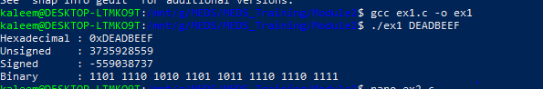
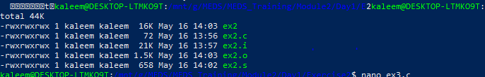
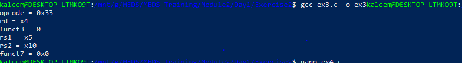
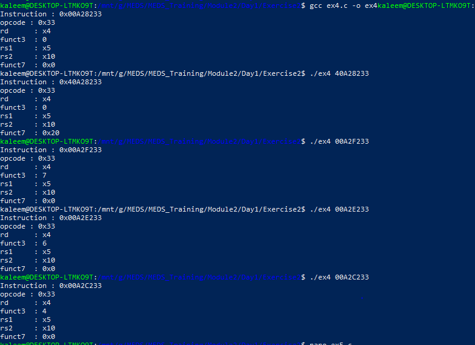
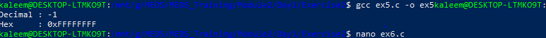
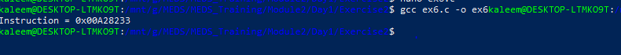

# Module 2 – C Language for Hardware Engineers

## Overview

**Day1 exercises** focusing on:

- C compilation pipeline
- Bitwise operations
- Instruction decoding (RISC-V)
- Sign extension
- Instruction encoding
- Low-level hardware concepts

These exercises simulate how a CPU processes instructions in systems like **RISC-V architecture**.

---

## Exercise 1 — Hex Value Analyzer

### Objective

Convert a 32-bit hex input into:

- Hexadecimal
- Unsigned decimal
- Signed decimal
- Binary representation

### How to Run

```bash
gcc ex1.c -o ex1
./ex1 DEADBEEF
```

### Output Screenshot



---

## Exercise 2 — Compilation Pipeline

### Objective

Understand all 4 compilation stages of GCC:

1. Preprocessing (-E)
2. Compilation (-S)
3. Assembly (-c)
4. Linking

### Commands

```bash
gcc -E main.c -o main.i
gcc -S main.c -o main.s
gcc -c main.c -o main.o
gcc main.o -o main
```

### Screenshot



### Observation — .s file size vs .c file

the _.s_ file can easily be several times bigger than the original _.c_ file because each C statement expands into multiple assembly instructions.

## Exercise 3 — Bit Field Extraction Function

### Objective

Implement:

```c
uint32_t extract_field(uint32_t instruction, int high, int low);
```

### Purpose

Extract specific bits `[high:low]` from a 32-bit instruction.

### Test Case

```c
0x00A28233 → add x4, x5, x10
```

### Output



## Exercise 4 — RISC-V Instruction Decoder

### Objective

Decode full RV32 instruction fields:

- opcode
- rd
- funct3
- rs1
- rs2
- funct7

### Run

```bash
./decoder 00A28233
```

### Output



## Exercise 5 — Sign Extension

### Objective

Convert smaller signed values into 32-bit signed integers.

### Test

```c
sign_extend(0xFFF, 12)
```

Expected:

```
-1
```

### Output



## Exercise 6 — R-Type Instruction Encoder (Bonus)

### Objective

Pack instruction fields into a 32-bit R-type instruction.

Fields:

- opcode
- rd
- funct3
- rs1
- rs2
- funct7

### Output Example

```text
0x00A28233 → add x4, x5, x10
```

### Output


