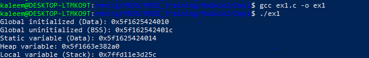
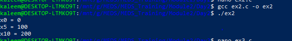
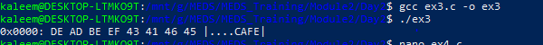
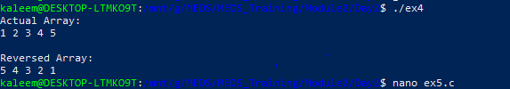
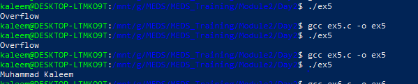
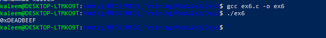

# Day 2 — Pointers, Arrays & Memory Layout

**Module 2: C Language for Hardware Engineers**

## Overview

This day focuses on understanding how C manages memory and how low-level hardware-style programming works.

Key topics:

- Memory layout (Stack, Heap, Data, BSS, Text)
- Pointers and addresses
- Arrays and pointer arithmetic
- Strings and safe operations
- Simulated hardware memory

These concepts are fundamental for embedded systems, OS development, and RISC-V architecture.

## Memory Layout (Concept)

C program memory structure:

```
Text (Code)
Data (Initialized globals)
BSS (Uninitialized globals)
Heap (Dynamic memory)
Stack (Local variables)
```

This maps directly to real CPU memory systems.

## Exercise 1 — Memory Segments Verification

### Objective

Identify where variables are stored in memory.

- Stack → local variables
- Heap → malloc
- Data → initialized globals
- BSS → uninitialized globals

### Output



## Exercise 2 — RISC-V Register File Simulation

### Objective

Simulate CPU registers (x0–x31)

Rules:

- x0 is always 0
- writes to x0 are ignored

### Output



## Exercise 3 — Memory Dump Tool

### Objective

Print memory like a hex viewer (xxd style)

Format:

```
0x0000: DE AD BE EF |....|
```

### Output



# Exercise 4 — Reverse Array (Pointer Only)

### Objective

Reverse array using pointer arithmetic only (no indexing)

Input:

```
1 2 3 4 5
```

Output:

```
5 4 3 2 1
```

### Output



## Exercise 5 — Safe String Concatenation

### Objective

Implement safe strcat to prevent buffer overflow.

### Output



## Exercise 6 — Simulated 256-Byte Memory (Bonus)

### Objective

Simulate RAM with:

- 256 bytes memory
- load/store 32-bit words
- alignment checking (multiple of 4)

### Output



## Important Concept

C does NOT check array bounds:

```c
arr[100] = 10;
```

This may corrupt memory and cause undefined behavior.
