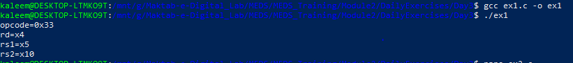
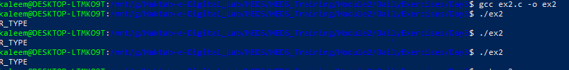
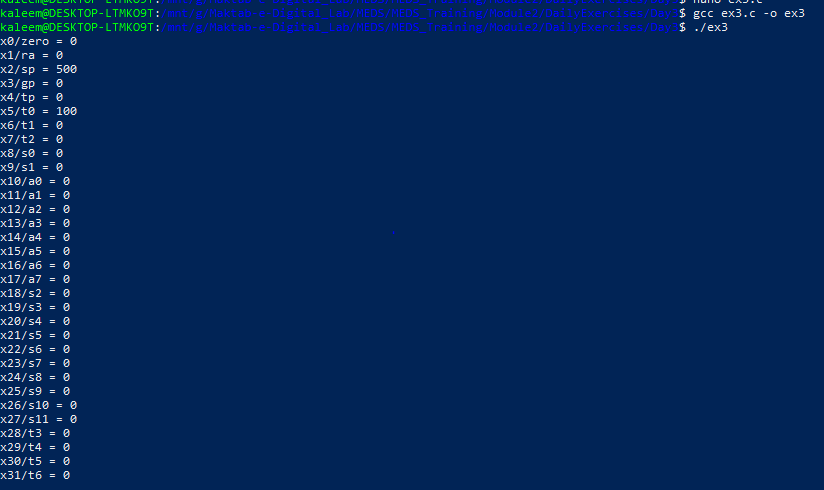
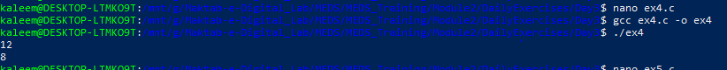
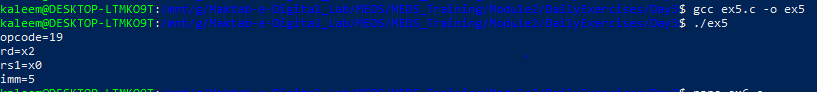
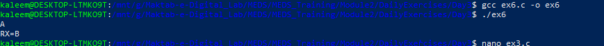

# Module 2 — Day 3

# Structs, Unions, Enums & Hardware Connection (RISC-V)

## Overview

Day 3 focused on modeling hardware-oriented data structures in C and connecting them to **RISC-V CPU architecture** concepts.

## Exercise 1 — R-Type Instruction Decoder using Struct

### Objective

Create a `decoded_instr_t` structure and decode a RISC-V R-type instruction.

Instruction tested:

```text
0x00A28233
```

Decoded instruction:

```text
add x4, x5, x10
```

Fields extracted:

- opcode
- rd
- funct3
- rs1
- rs2
- funct7

### Output Screenshot



---

## Exercise 2 — Opcode Enum & Mnemonic Mapping

### Objective

Create `opcode_t` enum containing RV32I opcodes and implement:

```c
opcode_to_string()
```

Example:

```text
0x33 → OP_R_TYPE
```

Implemented opcodes:

- R_TYPE
- LOAD
- STORE
- BRANCH
- JAL
- JALR
- LUI
- AUIPC
- SYSTEM

### Output Screenshot



---

## Exercise 3 — CPU State Model

### Objective

Implement a simplified RV32 CPU model.

Implemented:

- cpu_init()
- reg_write()
- reg_read()
- dump_registers()

Features:

- 32 registers
- Program Counter
- ABI register names
- x0 protection

ABI examples:

```text
x0 → zero
x1 → ra
x2 → sp
```

### Output Screenshot



## Exercise 4 — Struct Padding Analysis

### Objective

Predict structure size manually and verify using `sizeof()`.

Initial structure:

```c
struct A{
    uint8_t a;
    uint32_t b;
    uint8_t c;
};
```

Predicted:

```text
12 bytes
```

Optimized structure:

```c
struct B{
    uint32_t b;
    uint8_t a;
    uint8_t c;
};
```

Predicted:

```text
8 bytes
```

### Output Screenshot



## Exercise 5 — Instruction Union Decoder

### Objective

Create instruction union with:

- raw access
- I-type view

Instruction:

```text
0x00500113
```

Decoded:

```text
addi x2, x0, 5
```

Extracted:

- opcode
- rd
- rs1
- immediate

### Output Screenshot



## Exercise 6 (Bonus) — UART Peripheral Model

### Objective

Model UART registers using a struct.

Registers:

```text
control
status
tx_data
rx_data
```

Functions:

```text
uart_putchar()
uart_getchar()
```

Simulates memory-mapped peripheral access.

### Output Screenshot



## Day 3 Summary

Day 3 connected C programming with hardware concepts:

```text
Structs → Hardware blocks / register maps

Enums → Control signals / opcodes

Unions → Instruction decoding

CPU struct → Processor state model

UART struct → Peripheral registers
```
