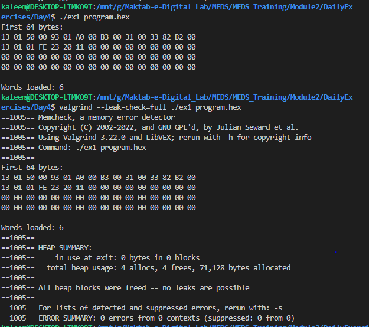
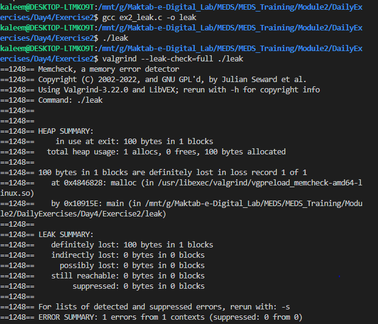
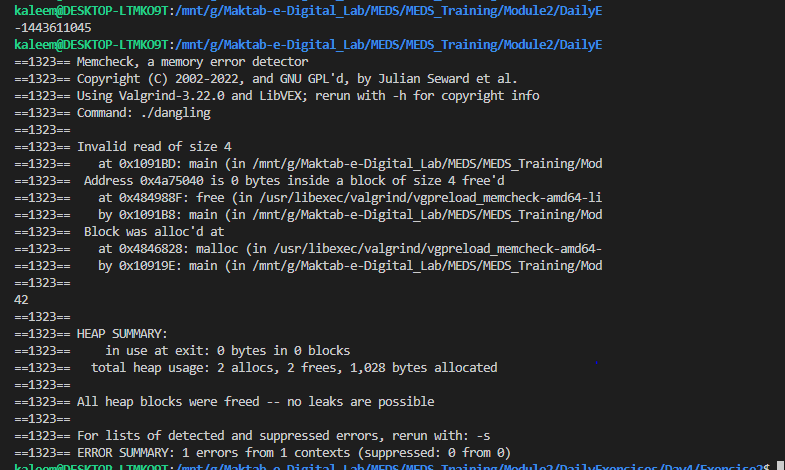
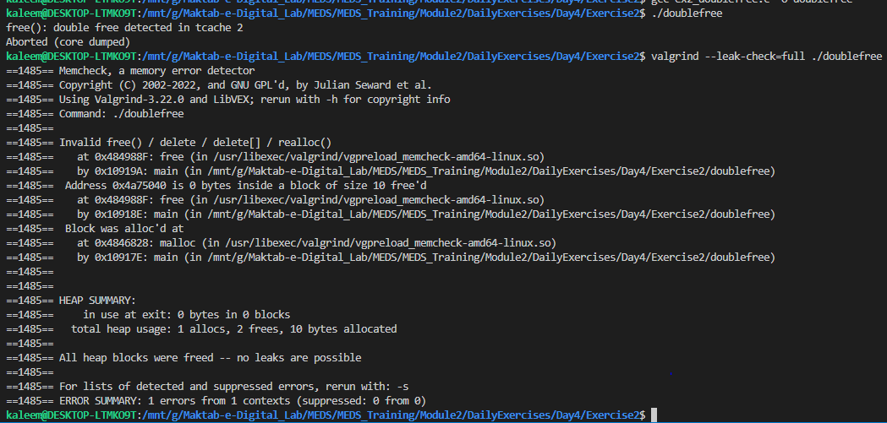
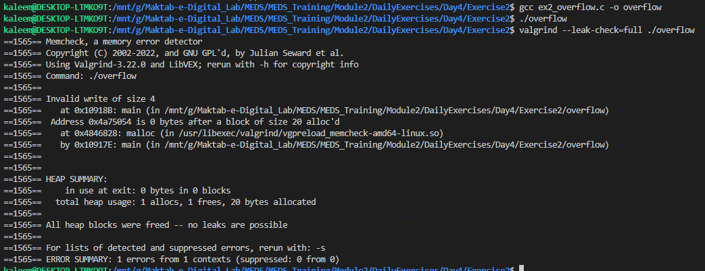
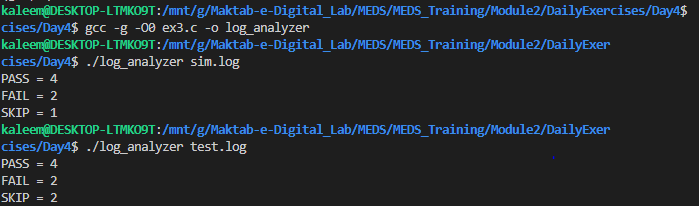
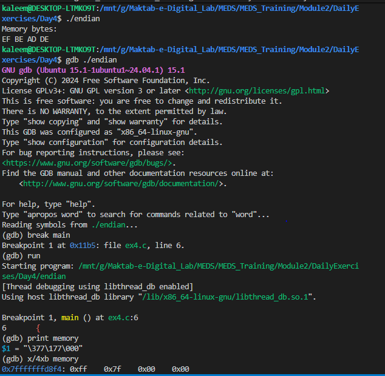
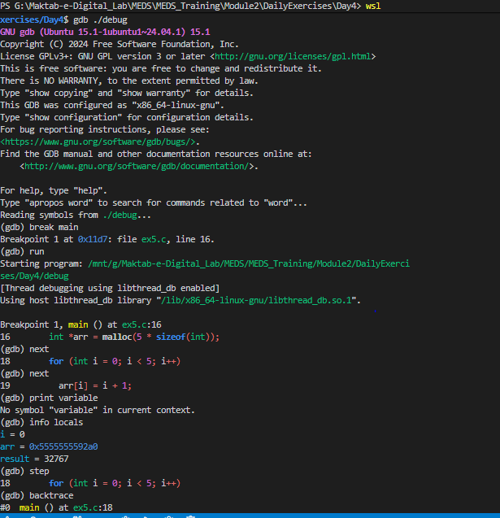
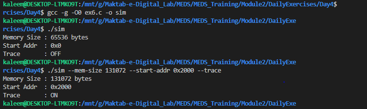

# Module 2 — Day 4

# Dynamic Memory, File I/O & Debugging (RISC-V Simulator Core)

## Overview

Day 4 focused on **memory management, file handling, and debugging tools** required to build a real **RISC-V simulator backend in C**.

## Exercise 1 — 64KB Memory Loader + Hex File Execution

### Objective

Allocate a **64KB simulated memory**, load a RISC-V hex program, dump memory, and verify correctness.

### Implementation

- Memory allocated using `calloc(65536)`
- Hex file parsed using `fgets()`
- Each 32-bit word converted using `strtoul()`
- Stored in **little-endian format**

#### Execution Flow

Start Program
↓
Allocate 64KB memory
↓
Open hex file
↓
Read instruction line
↓
Convert hex → uint32
↓
Store as bytes (little endian)
↓
Repeat until EOF
↓
Dump first 64 bytes
↓
Free memory

### Output Screenshot:

## Exercise 2 — Memory Errors (The Four Memory Sins)

### Objective

Demonstrate real-world memory bugs and observe them using Valgrind.

### Output Screenshots

1. Memory Leak
   malloc()
   ↓
   no free()
   ↓
   memory not released

   

2. Dangling Pointer
   malloc()
   ↓
   free()
   ↓
   use pointer again
   ↓
   invalid access
   
3. Double Free
   malloc()
   ↓
   free()
   ↓
   free() again
   ↓
   heap corruption
   

4. Buffer Overflow
   malloc(5 integers)
   ↓
   write arr[5]
   ↓
   overwrite adjacent memory  
   

## Exercise 3 — Simulation Log Analyzer

### Objective

Read a CPU simulation log and count:

PASS
FAIL
SKIP

### Output Screenshot

## Exercise 4 — Endianness Verification (0xDEADBEEF)

Objective

Verify correct little-endian memory storage of 32-bit instructions.

Input
0xDEADBEEF
Byte Breakdown
DE AD BE EF
Stored in Memory (Little Endian)
Address → Value

0 → EF
1 → BE
2 → AD
3 → DE

### Output Screenshot

## Exercise 5 — Debugging with GDB

### Objective

Find and fix runtime bugs using GDB.

#### Debug Process

Compile with -g -O0
↓
Start GDB
↓
Set breakpoint
↓
Run program
↓
Step through execution
↓
Inspect variables
↓
Identify bug
↓
Fix code
↓
Re-run clean execution

#### Common GDB Commands Used

break main
run
next
step
print
print/x
info locals
backtrace
continue

### Output Screenshot

## Exercise 6 (Bonus) — Command Line Controlled Simulator

### Objective

Build a configurable simulation environment using CLI arguments.
Supported Flags
--mem-size
--start-addr
--trace

### Output Screenshot

## Day 4 Summary

Day 4 connected C programming with low-level system and CPU simulation concepts:

1. malloc/calloc/free → Heap memory management
2. fopen/fgets/fclose → File system interaction
3. little-endian → CPU memory architecture
4. GDB → Execution-level debugging
5. Valgrind → Memory correctness validation
6. argv parsing → Simulator configuration
