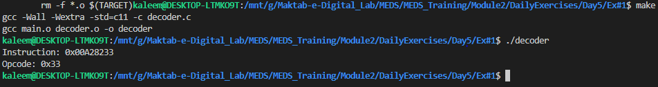
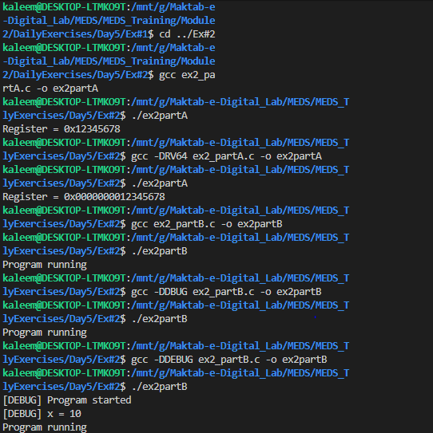
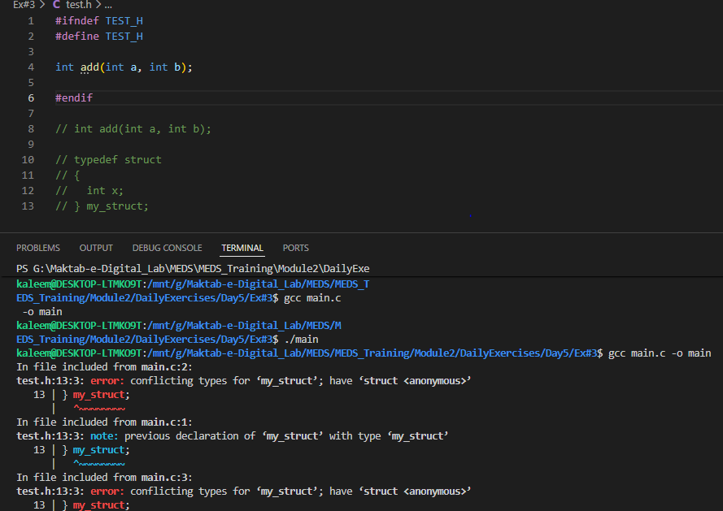

# Module 2 — Day 5

## Preprocessor, Multi-File Projects & Include Guards

### Overview

Day 5 focuses on professional C programming practices used in real-world systems such as:

- Multi-file project organization
- Header files and include guards
- Conditional compilation (`#ifdef`)
- Debug macros
- Makefile-based builds

## Exercise 1 — Multi-File Decoder Project

### Objective

Split a single-file decoder program into a modular structure:

- `main.c`
- `decoder.c`
- `decoder.h`
- `Makefile`

### Output

## Exercise 2 — Conditional Compilation & Debug Macros

### Objective

#### Implement:

RV32 vs RV64 support using #ifdef
Debug logging using -DDEBUG

#### Concepts Used

RV32 / RV64 Selection
#ifdef RV64
typedef uint64_t reg_t;
#else
typedef uint32_t reg_t;
#endif

#### Debug Macro

#ifdef DEBUG
#define LOG(fmt, ...) fprintf(stderr, "[DEBUG] " fmt "\n", ##**VA_ARGS**)
#else
#define LOG(fmt, ...)
#endif

### Output

## Exercise 3 — Include Guards

### Objective

Demonstrate prevention of multiple header inclusion using include guards.

### Purpose

#### Without include guards:

Multiple inclusion causes redefinition errors

#### With include guards:

Header is included only once safely

### Output

### Summary of Day 5

Exercise Concept Key Learning:
Ex 1 Multi-file project Modular C programming + Makefile
Ex 2 Conditional compilation RV32/RV64 switching + debug logging
Ex 3 Include guards Prevent header redefinition errors
